# Get Folder
1.git clone "app"

# Exec db
1. ```docker-compose up -d```
1. testar db dbeaver

# Env
1. ```python -m venv .venv```
1. ```.venv\Scripts\activate```
1. ```pip install -r requirements_dev.txt```
 
# Exec
1. ```python app/main.py```
1. Testar no /localhost:8003/docs

# Images

## Docker
1. ```Criar uma imagem do PostgreSQL (docker-composer.yml)```
   <br>
   <b>Alana-postgree (container)<b>
  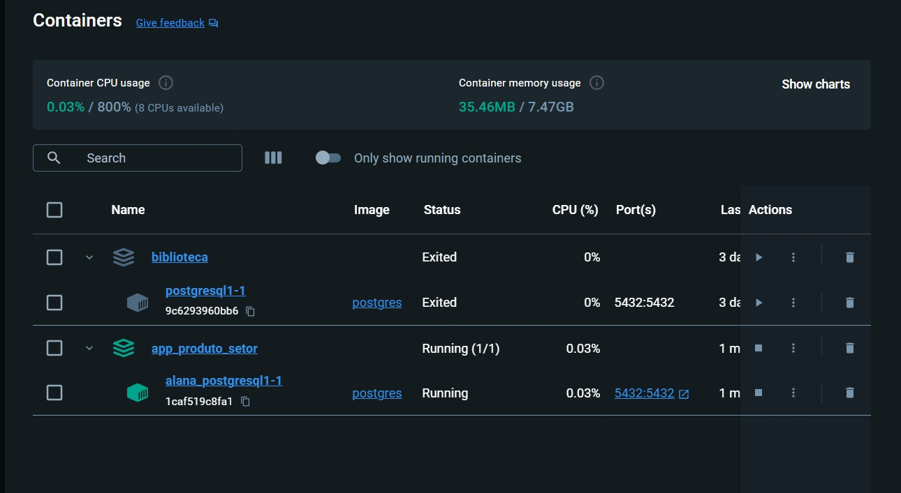<br>
## Dbeaver
1. ```Testar conexão com o banco de dados```
   <br>
   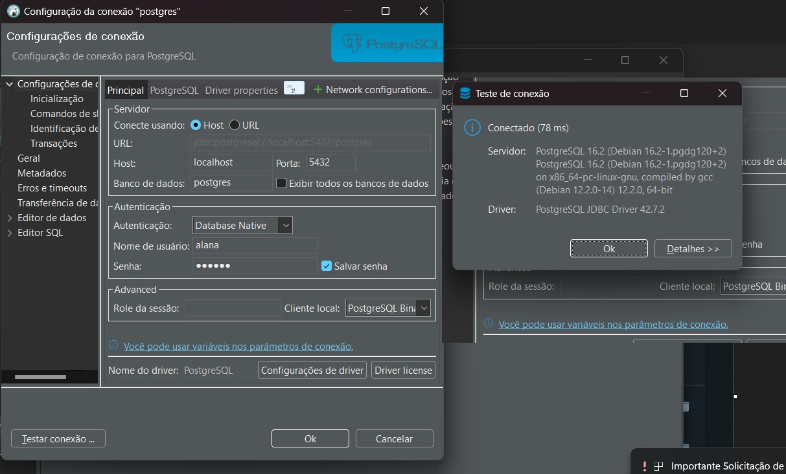<br>
   <br><br>
2. ```TB USUARIOS```
   <br>
   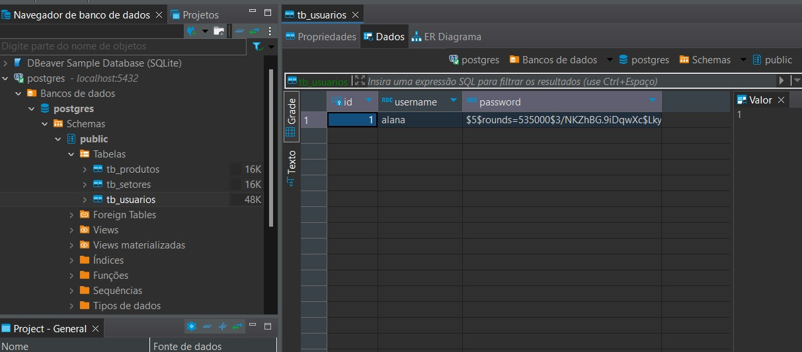<br>
    <br><br>
3. ```TB PRODUTOS e TB SETOR```
   <br>
   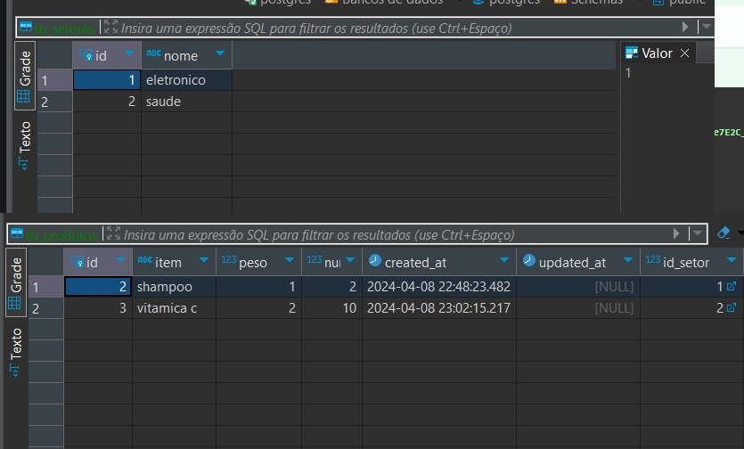<br>

## Swagger
1. ```Abrir o swagger para testar os metodos```
   <br>
 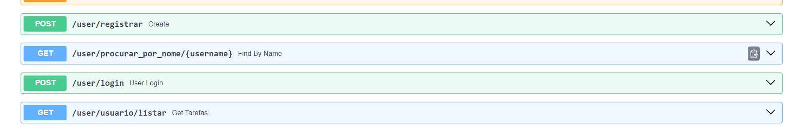<br>
  <br><br>
2. ```Metodo registrar```
   <br>
   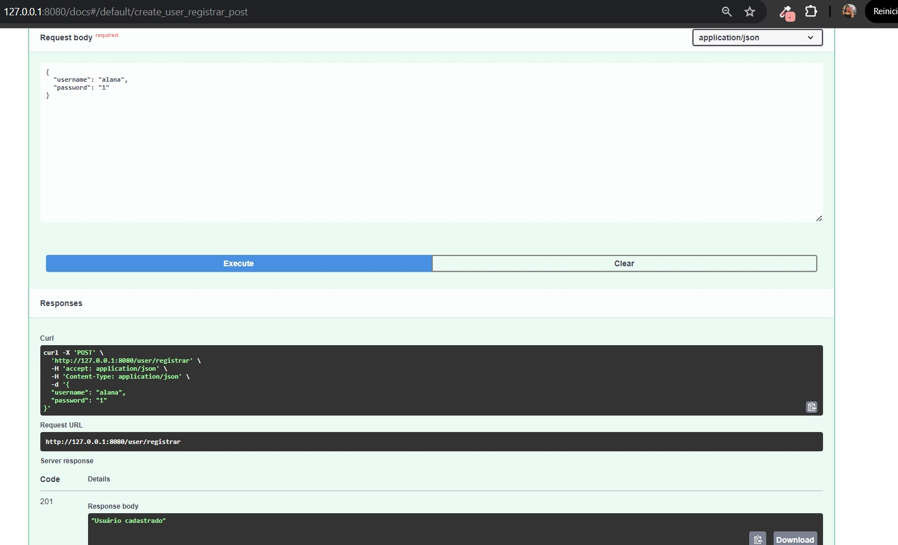<br><br><br>
3. ```Listar usuarios```
  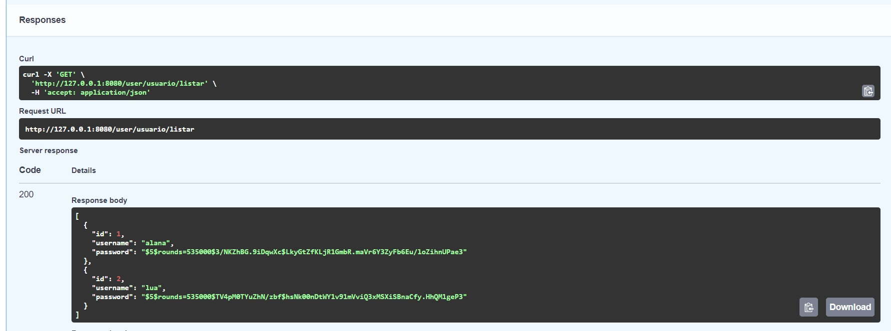<br>
  <br><br>
 4. ```Procurar por nome```
  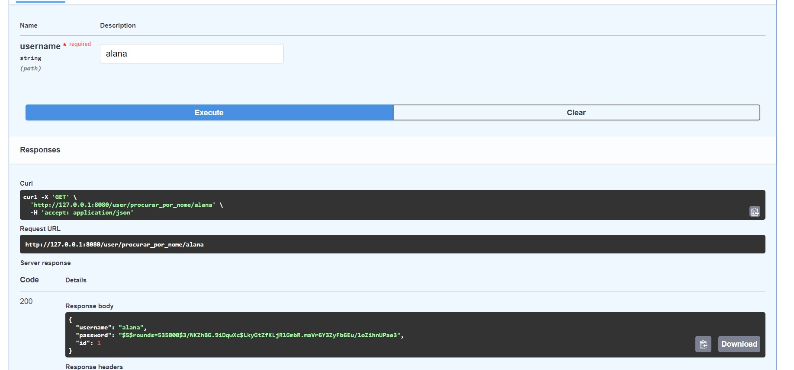<br>
  <br><br>
 5. ```Autorização negada```
    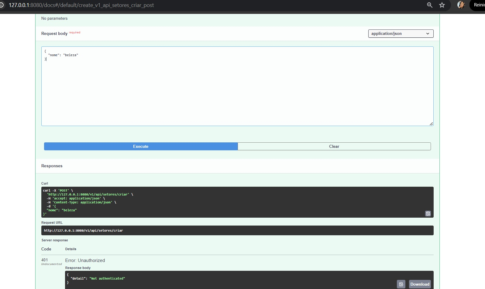<br>
  <br><br>
 6. ```Auth```
<br>
  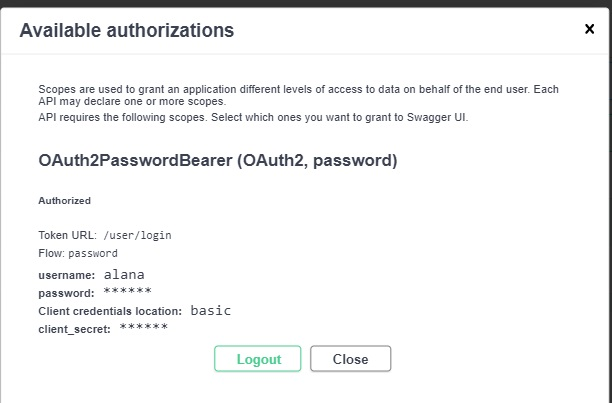<br>
  <br><br>
 7. Criar setor
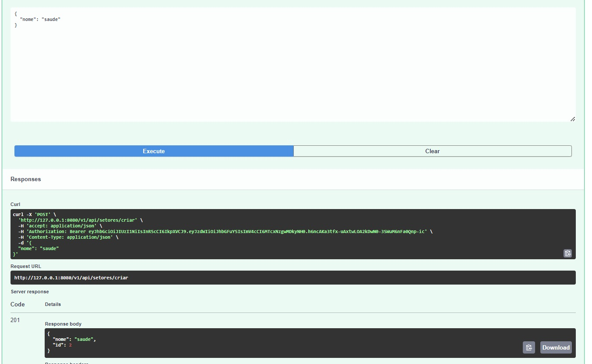<br>
  <br><br>
 8. Criar produto
 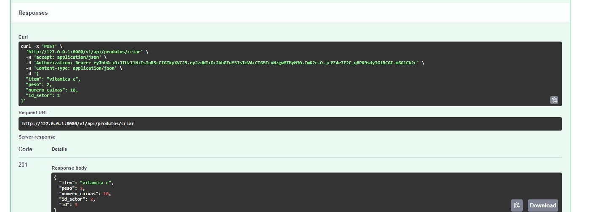<br>
  <br><br>
